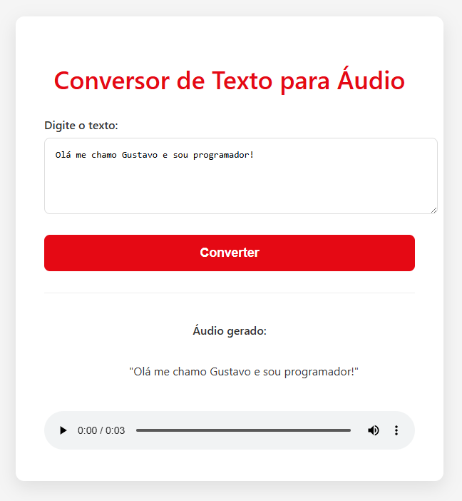

# 🔊 Conversor de Texto para Áudio com Laravel

Este projeto é uma aplicação web simples desenvolvida em **Laravel** que demonstra a integração com uma API de Text-to-Speech (TTS) externa (Deepgram). O usuário insere um texto em um formulário e a aplicação o converte em um áudio que pode ser reproduzido diretamente no navegador.

A solução foi desenvolvida com foco em **boas práticas**, **organização de código** e **eficiência** para o consumo de APIs externas.


## ✨ Demonstração do Projeto



## 🚀 Requisitos e Instalação

Para rodar este projeto em seu ambiente local, certifique-se de que você tem os seguintes requisitos instalados:

- **PHP** >= 8.0
- **Composer**
- Uma chave de API da **Deepgram**

### 📦 Instalação
Siga estes passos para configurar e executar a aplicação:

1.  Clone o repositório para o seu computador:
    ```bash
    git clone [URL_DO_SEU_REPOSITÓRIO]
    cd teste
    ```

2.  Instale as dependências do Composer:
    ```bash
    composer install
    ```

3.  Configure o arquivo de ambiente:
    ```bash
    cp .env.example .env
    ```

4.  Gere a chave de segurança da aplicação:
    ```bash
    php artisan key:generate
    ```

5.  Adicione sua chave da Deepgram no arquivo `.env`. Você pode obtê-la na seção de perfil da sua conta.
    ```env
    DEEPGRAM_API_KEY=sua_chave_aqui
    ```

### 🏃 Execução

Para iniciar o servidor de desenvolvimento do Laravel, execute o comando:

```bash
php artisan serve

```
### Autor:
Gustavo Vinicius Elias Souza Silva
